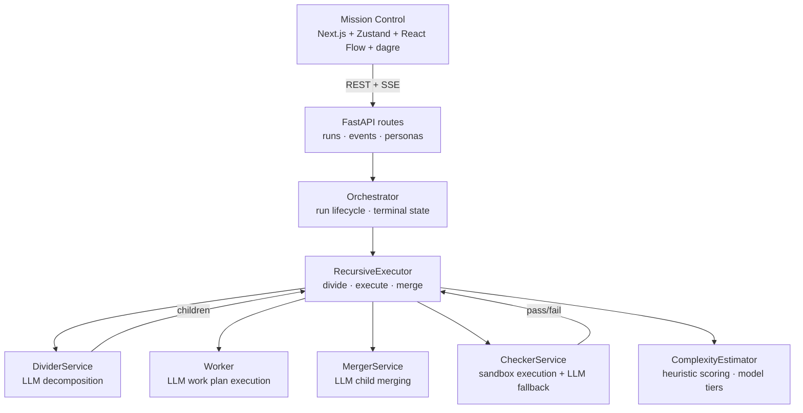
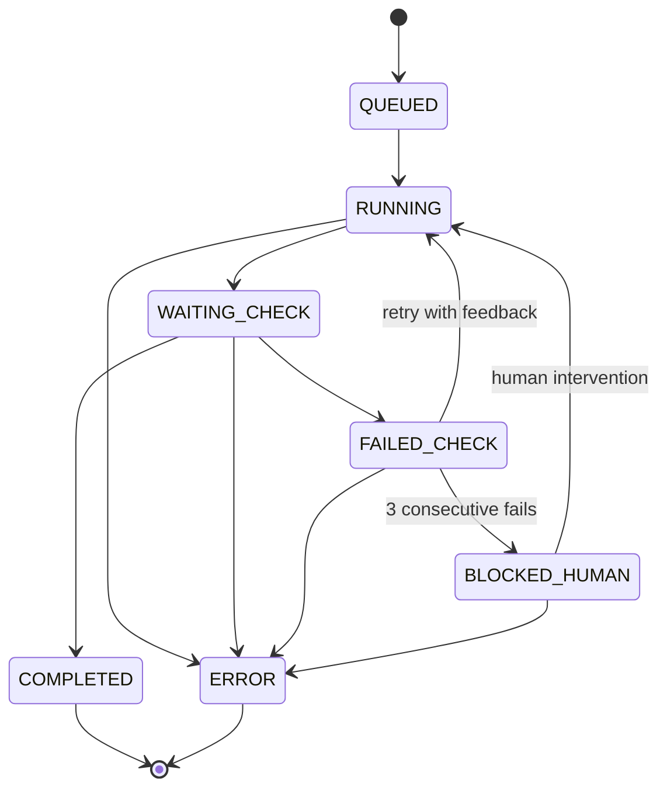

# Recursia

Recursive divide-conquer-merge agent orchestration engine. One objective in, structured execution tree out — with live graph UI, checker verification, and proposal-based file generation.

FastAPI backend + Next.js frontend.

## Highlights

- Recursive divide-route-execute workflow with complexity-adaptive depth
- Persona-based execution with markdown-backed profiles and persona chaining
- Cost-aware routing: complexity tiers map to configurable LLM models
- Token budget management with per-run and per-node limits
- Live run graph (dagre layout) and SSE event console
- Proposal-based file generation with review-and-apply workflow
- Checker self-heal: `pause` (human-in-the-loop) and `auto_retry` modes
- Sandbox isolation: subprocess (dev) or Docker epicbox (production)

## Repository Layout

- `backend/` — FastAPI API, orchestration runtime, state management, tests
- `frontend/` — Next.js Mission Control UI, component/E2E tests
- `personas/` — Markdown persona profiles discovered at runtime
- `run.sh` — Linux/macOS launcher (subcommands: `setup`, `full`, `backend`, `frontend`, `stub`, `menu`)
- `run.bat` — Windows launcher
- `docker-compose.yml` — PostgreSQL + backend + frontend (requires Dockerfiles)

## Quick Start

### Using launchers

```bash
# Linux/macOS
bash ./run.sh          # interactive menu
bash ./run.sh stub     # no LLM key needed — deterministic mode

# Windows
.\run.bat
```

### Manual startup

**Backend:**

```bash
cd backend
cp .env.example .env   # configure LLM provider
uv sync
uv run uvicorn main:app --reload
```

**Frontend:**

```bash
cd frontend
npm ci
npm run dev
```

The frontend expects the backend at `http://127.0.0.1:8000` by default.

### Stub mode (no LLM key)

Set `LLM_PROVIDER=stub` in `backend/.env` for deterministic local development. The stub returns fixed responses — useful for testing the orchestration flow without API costs.

## Configuration

### Backend (`backend/.env`)

| Variable | Default | Description |
|---|---|---|
| `LLM_PROVIDER` | `bedrock` | `gemini`, `groq`, `bedrock`, or `stub` |
| `GEMINI_API_KEY` | — | Google Gemini API key |
| `GROQ_API_KEY` | — | Groq API key |
| `AWS_REGION` | `us-east-1` | AWS region for Bedrock |
| `BEDROCK_MODEL_ID` | `anthropic.claude-sonnet-4-20250514-v1:0` | Bedrock model ARN |
| `LLM_MODEL` | — | Override provider default model |
| `LLM_TEMPERATURE` | `0.0` | Default temperature |
| `LLM_TIMEOUT_SECONDS` | `120` | LLM call timeout |
| `LLM_MAX_RETRIES` | `2` | Schema retry attempts |
| `DATABASE_URL` | `sqlite:///recursia.db` | `sqlite:///path` or `postgresql://...` |
| `SANDBOX_ENABLED` | `true` | Enable execution-based verification |
| `SANDBOX_BACKEND` | `local` | `local` (subprocess) or `docker` (epicbox) |
| `BACKEND_CORS_ORIGINS` | `http://127.0.0.1:3000,http://localhost:3000` | Comma-separated allowed origins |
| `LLM_MODEL_TIER_FAST` | — | Model for trivial tasks (complexity < 0.3) |
| `LLM_MODEL_TIER_STANDARD` | — | Model for medium tasks |
| `LLM_MODEL_TIER_STRONG` | — | Model for complex tasks (complexity > 0.7) |

### Frontend (`frontend/.env.local`)

| Variable | Default | Description |
|---|---|---|
| `NEXT_PUBLIC_API_BASE_URL` | `http://127.0.0.1:8000` | Backend URL |

## API

### Runs

| Method | Path | Description |
|---|---|---|
| `POST` | `/api/runs` | Create a run (`objective`, `config`, `base_persona_id`) |
| `GET` | `/api/runs/{run_id}` | Get run graph (nodes + edges) |
| `GET` | `/api/runs/{run_id}/result` | Get run result with validation |
| `GET` | `/api/runs/{run_id}/events` | SSE event stream (replay from `Last-Event-Id`) |
| `DELETE` | `/api/runs/{run_id}/nodes/{node_id}` | Delete node and descendants |
| `POST` | `/api/runs/{run_id}/nodes/{node_id}/interventions` | Apply human intervention |

### System

| Method | Path | Description |
|---|---|---|
| `GET` | `/health` | Liveness probe |
| `GET` | `/ready` | Readiness gate (503 if provider unhealthy) |
| `GET` | `/system/config-summary` | Non-secret config snapshot |
| `GET` | `/api/personas` | List available personas |

## RunConfig

```json
{
  "checker": {
    "enabled": true,
    "max_retries_per_node": 3,
    "onCheck_fail": "auto_retry"
  },
  "max_depth": 8,
  "max_children_per_node": 10,
  "decomposition_candidates": 3,
  "re_decompose_after": 2,
  "complexity_threshold": 0.6,
  "adaptive_depth": false,
  "persona_chain": null,
  "token_budget": {
    "max_total_tokens": 500000,
    "max_tokens_per_node": 50000,
    "on_exhausted": "fail"
  }
}
```

- `adaptive_depth` — use complexity estimator's suggested depth instead of fixed max_depth
- `persona_chain` — array of persona IDs to run sequentially (each refines prior output)
- `token_budget` — per-run token cap with fail/warn on exhaustion

## Architecture



### Key services

- **RecursiveExecutor** — orchestrates the divide-execute-merge loop per node. Handles depth limits, token budgets, persona chains, cost-aware routing, checker retries, and HITL blocking.
- **DividerService** — LLM-driven decomposition with multi-candidate generation and complexity scoring.
- **LLMBaseCaseWorker** — executes multi-step work plans with persona-aware LLM calls and sliding context.
- **MergerService** — merges child outputs with conflict detection.
- **CheckerService** — evaluates node output via sandbox execution or LLM fallback.
- **ComplexityEstimator** — heuristic scoring (no LLM) for adaptive depth and model tier selection.
- **EventStreamService** — SSE fanout with sequence-based replay.

### State machine

Nodes follow a strict transition map defined in `app/domain/policies.py`:



Transitions are validated by `ensure_*_transition()` functions. Invalid transitions raise `PolicyViolation`.

### Service wiring

Services are wired in `app/__init__.py` via `_build_services()` and stored in the `_active` dict in `app/api/runs.py`. Tests use `set_runs_services()` / `reset_runs_services()` for DI.

## Testing

```bash
# Backend (132 tests)
cd backend && uv run pytest -q

# Frontend component tests (20 tests)
cd frontend && npm run test:components

# Frontend typecheck
cd frontend && npm run typecheck

# Frontend build
cd frontend && npm run build

# E2E tests (Playwright)
cd frontend && npm run test:e2e
```

## CI

GitHub Actions runs on push/PR across Windows, macOS, Linux:

- Backend: `ruff check` + `pytest -q`
- Frontend: `typecheck` + `test:components` + `npm run build`
- Launcher syntax: `bash -n run.sh`

## Tooling

- **Backend:** Python 3.11, FastAPI, litellm, Pydantic, tenacity, uv
- **Frontend:** Next.js 15, React 18, Zustand, React Flow, dagre, Vitest, Playwright
- **LLM providers:** AWS Bedrock, Google Gemini, Groq, or stub (deterministic)

## License

Apache License 2.0
