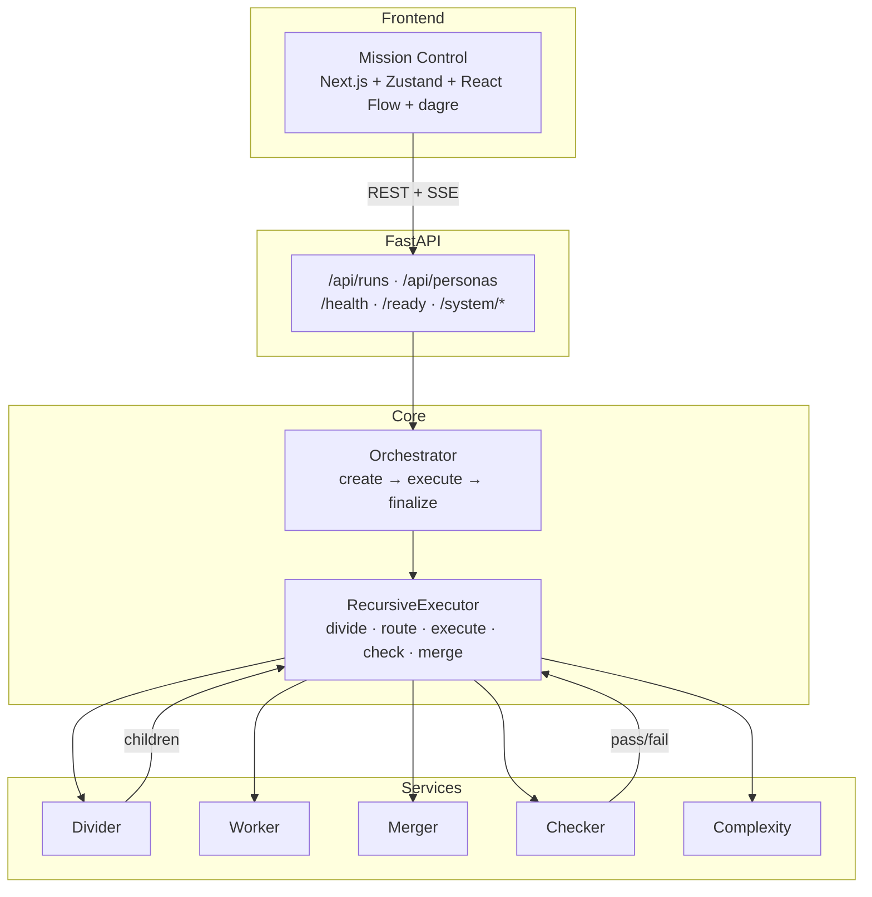
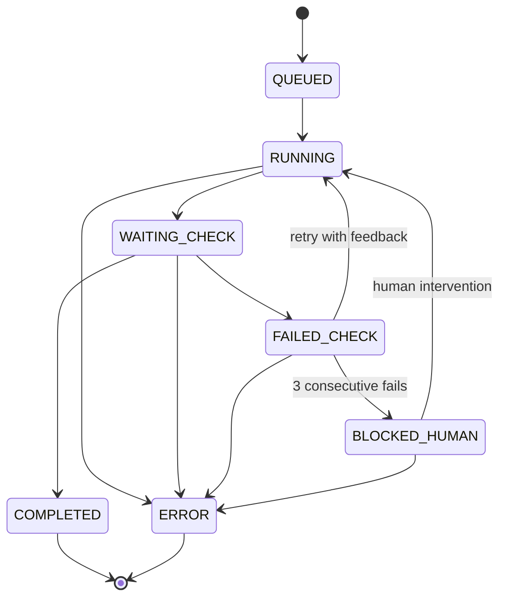
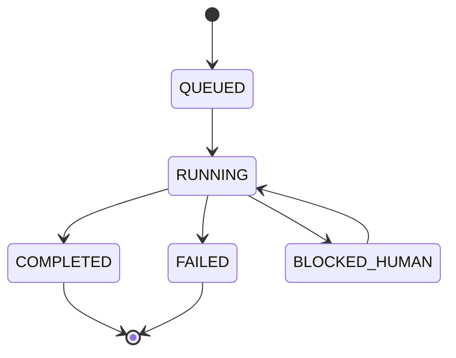

# Architecture

Recursia is a recursive divide-conquer-merge agent orchestration engine. An objective enters, gets decomposed into a tree of sub-tasks, each executed by persona-aware LLM calls, verified by checkers, and merged back up.

## System Overview



## Layer Responsibilities

### API Layer (`app/api/`)

- `runs.py` — Service wiring (`_active` dict), run CRUD, dependency injection via `set_runs_services()` / `reset_runs_services()`
- `events.py` — SSE endpoint with sequence-based replay and `Last-Event-Id` support
- `personas.py` — Read-only persona listing

### Domain Layer (`app/domain/`)

- `models.py` — Core data structures: `RunState`, `NodeState`, `NodeContext`, `EdgeRecord`, `InterventionRecord`
- `events.py` — `DomainEvent` and `DomainEventType` enum (25+ event types)
- `enums.py` — `RunStatus`, `NodeStatus`, `NodeDecision`, `CheckerOutcome`, `ExecutionTerminal`
- `policies.py` — Transition maps and `ensure_*_transition()` validators

### Services Layer (`app/services/`)

- `orchestrator.py` — Run lifecycle coordination
- `executor.py` — Recursive divide-execute-merge loop (the core)
- `divider.py` — LLM-driven decomposition with multi-candidate generation
- `worker.py` — Multi-step work plan execution with persona awareness
- `merger.py` — Child output merging with conflict detection
- `checker.py` — Checker evaluation (LLM-based and sandbox-based)
- `checker_handler.py` — Shared retry logic for checker failures
- `complexity.py` — Heuristic complexity scoring (no LLM calls)
- `persona_registry.py` — Markdown persona profile loading
- `persona_router.py` — Persona selection based on task context
- `event_stream.py` — SSE fanout with sequence tracking
- `test_generator.py` — Auto-generates test cases for sandbox verification
- `execution_checker.py` — Sandbox-based code execution checker
- `stubs.py` — Deterministic stubs for testing without LLM

### Adapters (`app/adapters/`)

- `llm_client.py` — `LLMClient` protocol, `LiteLLMClient`, `StubLLMClient`, `UsageTrackingClient`
- `llm_factory.py` — Provider-specific client construction

### State (`app/state/`)

- `repository.py` — Abstract `RunStateRepository` with 25+ methods
- `memory_repo.py` — In-memory implementation (MVP/testing)
- `sqlite_repo.py` — SQLite implementation (durable persistence)

### Schemas (`app/schemas/`)

- `api.py` — Pydantic models: `RunConfig`, `CheckerConfig`, `TokenBudget`, `CreateRunRequest`
- `contracts.py` — Pydantic models: `DividerResult`, `WorkExecutionResult`, `CheckerResult`

### Observability (`app/observability/`)

- `logging.py` — Structured JSON logging
- `metrics.py` — In-memory TTFT/duration/checker counters

### Sandbox (`app/sandbox/`)

- `executor.py` — `SandboxExecutor` with `SubprocessBackend` and `EpicboxBackend`

## State Machine

Nodes follow a strict transition map (`app/domain/policies.py`):



Runs:



Invalid transitions raise `PolicyViolation`. The transition maps are plain dicts — no framework, no magic.

## Service Wiring

```
_lifespan(app)
    │
    ├─ _build_services()
    │   ├─ repository = InMemoryRunStateRepository | SQLiteRunStateRepository
    │   ├─ event_stream = EventStreamService(repository)
    │   ├─ llm_client = UsageTrackingClient(LiteLLMClient | StubLLMClient)
    │   ├─ checker = CheckerService(LLMCheckerClient | ExecutionCheckerClient)
    │   ├─ divider = DividerService(llm_client)
    │   ├─ merger = MergerService(llm_client)
    │   ├─ worker = LLMBaseCaseWorker(llm_client, persona_registry)
    │   ├─ executor = RecursiveExecutor(repository, divider, worker, merger, checker, ...)
    │   └─ orchestrator = Orchestrator(repository, executor, event_stream)
    │
    ├─ set_runs_services(repository, orchestrator, event_stream)
    │   └─ stores in _active dict in runs.py
    │
    └─ _recover_interrupted_runs(repository, event_stream)
        └─ marks orphaned RUNNING runs as FAILED on startup
```

Tests use `set_runs_services()` to inject mocks. `reset_runs_services()` clears the `_active` dict.

## Frontend Architecture

- **State:** Zustand store (`src/state/runStore.ts`) with selectors for selective re-renders
- **Graph:** React Flow + dagre hierarchical layout (`rankdir: "LR"`)
- **SSE:** `RunEventsClient` in `src/lib/events.ts` with sequence dedup and auto-reconnect
- **Components:** GraphCanvas, NodeDetailsDrawer, RunInput, RunConsole, RunResultPanel, ProposedFilesPanel, WorkspaceTargetPanel, InterventionPanel, RunMetricsBar, ErrorBoundary
